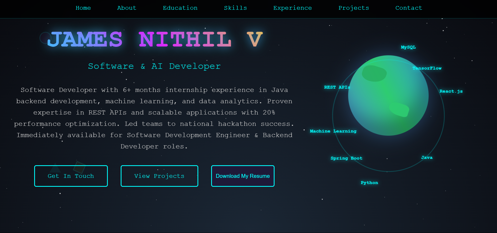

# 🌐 Portfolio Website

Welcome to my personal portfolio website of James Nithil V! This is a responsive, modern, and minimal portfolio designed to showcase my work, skills, and background. Built using HTML,CSS,JavaScript, it's deployed and live at: [https://nithiljn.github.io/Nithil_portfolio/]

## 📸 Preview

 

## 🚀 Features

- Fully responsive design
- About section
- Project showcase with images
- Resume download
- Contact form (email)
- Smooth scrolling and animations

## 🛠️ Built With

- HTML5, CSS3, JavaScript
- [React ]
- [Bootstrap  custom CSS]
- [EmailJS]
- Deployed with [ GitHub Pages ]

## 📂 Project Structure
portfolio-website/
│
├── public/
│ ├── images/
│ └── james.png
│
├── src/
│ ├── assets/
│      └── index.js


## 🔧 Setup Instructions

1. Clone the repository:

```bash
git clone https://github.com/yourusername/portfolio-website.git
cd portfolio-website
